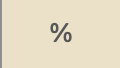

# SmartCalc

[Реализация SmartCalc](#реализация-smartcalc) \
[Паттерн MVC](#паттерн-mvc) \
[Обратная Польская нотация](#обратная-польская-нотация) \
[Поддерживаемые операции](#поддерживаемые-операции) \
[Построение графиков](#построение-графиков) \
[Кредитный калькулятор](#кредитный-калькулятор)

В проекте реализован калькулятор в парадигме объектно-ориентированного программирования. Для реализации калькулятора использован алгоритм Дейкстры для перевода выражений в обратную польскую нотацию. При реализации пользовательского интерфейса использовался QT-creator.

## Реализация SmartCalc
Программа разработана на языке C++ стандарта C++17. \
Код программы находится в папке src. \
Подготовлено полное покрытие unit-тестами модулей, связанных с вычислением выражений, c помощью библиотеки GTest. \
Сборка программы настроена с помощью Makefile со стандартным набором целей для GNU-программ: all, install, uninstall, clean, dvi, dist, tests. \
Реализация с графическим пользовательским интерфейсом на базе QT. \
Программа реализована с использованием паттерна MVC. \
На вход программы могут подаваться как целые числа, так и вещественные числа, записанные и через точку, и в экспоненциальной форме записи. \
Вычисление должно производится после полного ввода вычисляемого выражения и нажатия на символ = \
Вычисление произвольных скобочных арифметических выражений в инфиксной нотации. \
Вычисление произвольных скобочных арифметических выражений в инфиксной нотации с подстановкой значения переменной x в виде числа. \
Построение графика функции, заданной с помощью выражения в инфиксной нотации с переменной x  (с координатными осями, отметкой используемого масштаба и сеткой с адаптивным шагом). \
Область определения и область значения функций ограничиваются по крайней мере числами от -1000000 до 1000000 \
Для построения графиков функции необходимо дополнительно указывать отображаемые область определения и область значения. \
Проверяемая точность дробной части - минимум 7 знаков после запятой. \
У пользователя есть возможность ввода до 255 символов. \

## Паттерн MVC7
В проекте применен паттерн MVC. 
Паттерн MVC (Model-View-Controller, Модель-Представление-Контроллер) представляет из себя схему разделения модулей приложения на три отдельных макрокомпонента: модель, содержащую в себе бизнес-логику, представление - форму пользовательского интерфейса для осуществления взаимодействия с программой и контроллер, осуществляющий модификацию модели по действию пользователя.

## Обратная Польская нотация
Обра́тная по́льская за́пись (англ. Reverse Polish notation, RPN) — форма записи математических и логических выражений, в которой операнды расположены перед знаками операций. Также именуется как обратная бесскобочная запись, постфиксная нотация, бесскобочная символика Лукасевича, польская инверсная запись, ПОЛИЗ.

[https://habr.com/ru/articles/100869/](https://habr.com/ru/articles/596925/)

## Поддерживаемые операции.

| Операция                      | Инфиксная нотация | Префиксная нотация | Постфиксная нотация |
|-------------------------------|-------------------|--------------------|---------------------|
|  | (a + b)           | (+ a b)            | a b +               |
|       | a + b             | + a b              | a b +               |
|       | a - b             | - a b              | a b -               |
|       | a * b             | * a b              | a b *               |
|       | a / b             | / a b              | a b \               |
|       | a ^ b             | ^ a b              | a b ^               |
|       | +a                | +a                 | a+                  |
|             |
| Вычисляет натуральный логарифм |               | 
| Вычисляет десятичный логарифм  |              |
| Вычисляет остаток от деления   |                |

| Описание                                   | Еще кнопки                     |   
|--------------------------------------------|--------------------------------|  
| Очистить строку                            |      |   
| Удалить один символ                        |    |  
| Получить результат                         |     |  
| Добавить в строку х и установить значение х|          | 

## Построение графиков.

|                  | При нажатии на клавишу  выполняется переход в окно построения графиков, до выхода из окна построения графиков, главное окно калькулятора становится не активным.                    |   
|--------------------------------------------|--------------------------------| 

 

В поля "Введите значения Х" и "Введите значения У" необходимо ввести параметры размера оси абсцисс и оси координат.

## Кредитный калькулятор.
|                  | При нажатии на клавишу  выполняется переход в окно кредитного калькулятора, до выхода из окна построения графиков, главное окно калькулятора становится не активным.                    |   
|--------------------------------------------|--------------------------------| 

 

## Как запустить.
- Необходимо перейти в папку src
- В терминале выполнить make install(окно калькулятора откроется автоматически)
- Если после установки окно калькулятора не открылось - выполнитьmake run
